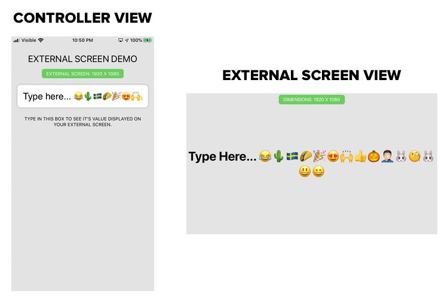

# ExternalScreen (iOS)

This is an Example XCode Project to demonstrate the capability of the [cordova-plugin-app-wkwebview-external-screen](https://github.com/josiaho/cordova-plugin-app-wkwebview-external-screen).

- Toggle AirPlay Mirroring on/off to see UI
- Displays dimensions of external screen
- Example of how to communicate between pages ([cordova-plugin-websocket-server](https://github.com/becvert/cordova-plugin-websocket-server) is great option too!)
